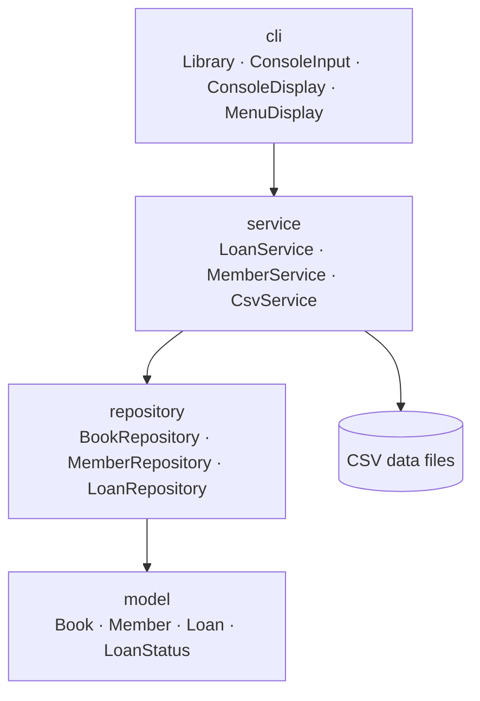

# library-management-system

A console library management system built on persistent CSV data.
Given the requirements, this is in the perspective of a librarian / administrator and not a member.

## Project Structure
```
library-management-system
├── .gitignore
├── README.md
├── console_library_management_system
│   ├── pom.xml
│   └── src
│       ├── main
│       │   └── java
│       │       └── librarymanagement
│       │           ├── cli
│       │           │   ├── ConsoleDisplay.java
│       │           │   ├── ConsoleInput.java
│       │           │   ├── Library.java
│       │           │   └── MenuDisplay.java
│       │           ├── exception
│       │           │   ├── BookNotFoundException.java
│       │           │   ├── BookUnavailableException.java
│       │           │   ├── InvalidInputException.java
│       │           │   ├── LibraryException.java
│       │           │   └── MemberNotFoundException.java
│       │           ├── model
│       │           │   ├── Book.java
│       │           │   ├── Loan.java
│       │           │   ├── LoanStatus.java
│       │           │   └── Member.java
│       │           ├── repository
│       │           │   ├── BookRepository.java
│       │           │   ├── LoanRepository.java
│       │           │   └── MemberRepository.java
│       │           ├── service
│       │           │   ├── CsvService.java
│       │           │   ├── LoanService.java
│       │           │   └── MemberService.java
│       │           └── util
│       │               └── ErrorHandling.java
│       └── test
│           └── java
│               └── librarymanagement
│                   ├── cli
│                   │   ├── ConsoleDisplayTest.java
│                   │   ├── ConsoleInputTest.java
│                   │   ├── LibraryTest.java
│                   │   └── MenuDisplayTest.java
│                   ├── model
│                   │   ├── BookTest.java
│                   │   ├── LoanTest.java
│                   │   └── MemberTest.java
│                   ├── repository
│                   │   ├── BookRepositoryTest.java
│                   │   ├── LoanRepositoryTest.java
│                   │   └── MemberRepositoryTest.java
│                   ├── service
│                   │   ├── CsvServiceConcurrencyTest.java
│                   │   ├── CsvServiceTest.java
│                   │   ├── LoanServiceTest.java
│                   │   └── MemberServiceTest.java
│                   └── util
│                       └── ErrorHandlingTest.java
├── data
│   ├── books.csv
│   ├── books_catalogue.csv
│   ├── books_inventory.csv
│   ├── books_loans.csv
│   └── library_members.csv
└── generate_library_catalogue
    ├── clean_csv.py
    ├── generate_inventory.py
    ├── generate_loans.py
    ├── generate_members.py
    └── requirements.txt
```
---

## Data source

The raw book data (`books.csv`, not tracked in this repo due to size) comes from:

**Best Books Ever Dataset** — [https://zenodo.org/records/4265096](https://zenodo.org/records/4265096)

Download it and place it in this folder as `books.csv` before running the scripts below.

## Generate Library Catalogue

### `clean_csv.py`
Builds `books_catalogue.csv` from the raw `books.csv`, keeping only `bookId, title, author, isbn`. Cleaning steps applied:
- Filters to `language == "English"` rows only
- Handles inconsistent numeric columns via `ignore_errors=True`
- Extracts the numeric prefix of `bookId` (e.g. `"2767052-the-hunger-games"` → `2767052`) and dedupe
- Keeps only rows where `isbn` is fully numeric, and dedupe
- Strips role annotations like `(Illustrator)`, `(Editor)` from `author`
- Drops truncated `"more…"` entries and non-Latin-script names from `author`, and flattens accented Latin characters (e.g. `é` → `e`)
- Drops rows with corrupted/mojibake titles or fully non-Latin-script titles, and strips stray stylized symbols (e.g. `★`, `™`, `→`) from the rest

Output: `books_catalogue.csv` (columns: `bookId, title, author, isbn`)

### `generate_inventory.py`
Generates `books_inventory.csv` from `books_catalogue.csv` with dummy copy counts for each book:
- `total_copies`: random value between 1 and 3
- `available_copies`: added later by `generate_loans.py` based on active loans

Output: `books_inventory.csv` (columns: `bookId, total_copies` initially; `available_copies` is added by `generate_loans.py`)

### `generate_members.py`
Generates `library_members.csv` with 500 dummy library members. Each member includes:
- A generated first name, last name, and email address
- A join date between 30 and 2,000 days ago
- A membership expiry date based on yearly renewals
- A `membership_status` of `Active` or `Expired`

Output: `library_members.csv` (columns: `memberId, first_name, last_name, email, join_date, membership_expiry_date, membership_status`)

### `generate_loans.py`
Generates `books_loans.csv` from `books_inventory.csv` — the loan history for each book:
- One `Borrowed` (active) loan row per currently checked-out copy (`total_copies - available_copies`), with checkout dates skewed recent so most active loans aren't overdue yet
- 0-2 historical `Returned` loan rows per book, with return dates skewed toward being on time
- `due_date` is `checkout_date + 14 days` (`LOAN_PERIOD_DAYS`) for every loan
- `is_overdue`, `overdue_days`, and `penalty_amount` (`overdue_days * $0.50/day`) are derived for both `Borrowed` (checked against today) and `Returned` (checked against `checkin_date`) loans
- Dummy `memberId` drawn from a pool of 500 possible members

Output: `books_loans.csv` (columns: `loanId, bookId, memberId, checkout_date, due_date, checkin_date, status, overdue_days, is_overdue, penalty_amount`)

## How to generate

Install dependencies:

```bash
pip install -r generate_library_catalogue/requirements.txt
```

Run the scripts in this order from the `generate_library_catalogue` directory:

```bash
python generate_library_catalogue/clean_csv.py
python generate_library_catalogue/generate_inventory.py
python generate_library_catalogue/generate_members.py
python generate_library_catalogue/generate_loans.py
```

Each script reads the output created by the previous step. The final step also updates `books_inventory.csv` with `available_copies`, based on the active loans it creates.

The generated files are written to the `data/` directory:

1. `books_catalogue.csv`
2. `books_inventory.csv`
3. `library_members.csv`
4. `books_loans.csv`

---

## Console Library Management System

### Feature Requirements
1.) Book catalogue (title, author, ISBN, total & available copies)

2.) Register members with unique IDs

3.) Check-out & check-in of copies

4.) Track loan history

5.) Search by title, author, ISBN

6.) Persist to CSV/JSON via java.nio.file (load on start, save on exit)

7.) Bulk-import books from CSV using parallel processing

8.) Clear CLI menu with helpful validation & error messages

### Where Each Requirement Is Implemented

| # | Requirement | Implementation |
|---|---|---|
| 1 | Book catalogue (title, author, ISBN, copies) | `Book` model, `BookRepository` |
| 2 | Register members with unique IDs | `MemberService.buildMember` generates the next ID from `MemberRepository` |
| 3 | Check-out & check-in | `LoanService.checkOut` / `checkIn` |
| 4 | Track loan history | `LoanRepository` + `Loan` record, viewable in the Loans menu |
| 5 | Search by title/author/ISBN | `BookRepository.searchByTitle/Author/Isbn`, paginated in the console |
| 6 | Persist to CSV via `java.nio.file` | `CsvService`, using `Files.readAllLines` / `Files.write` |
| 7 | Bulk-import books from CSV using parallel processing | `CsvService.loadBooksConcurrently` |
| 8 | Clear CLI menu with validation & error messages | `MenuDisplay`, `ErrorHandling`, custom exceptions |

### Mandatory Requirements
- ≥ 8 classes in clear packages
- ≥ 1 interface, 1 abstract class, 1 record, 1 enum
- Custom exception hierarchy (≥ 3 specific types)
- Meaningful collections, generics, streams
- JUnit 5 suite, ≥ 75% line coverage incl. failure paths
- ≥ 1 race-safe concurrency feature (ExecutorService / CompletableFuture)
- README with setup + short architecture diagram
- Maven build, portable relative paths — no secrets / no network

### Where Each Mandatory Requirement Is Implemented

| Requirement | Implementation |
|---|---|
| ≥ 8 classes in clear packages | `cli`, `service`, `repository`, `model`, `exception`, `util` packages |
| ≥ 1 interface | `Identifiable` (in `Book.java`), implemented by `Book` and `Member` |
| ≥ 1 abstract class | `LibraryException` — the base for all custom exceptions |
| ≥ 1 record | `Loan` |
| ≥ 1 enum | `LoanStatus` |
| Custom exception hierarchy (≥ 3 specific types) | `BookNotFoundException`, `MemberNotFoundException`, `BookUnavailableException`, `InvalidInputException` extend `LibraryException` |
| Meaningful collections, generics, streams | repositories use `Map`/`List` with generics; search & filtering use streams |
| JUnit 5 suite, ≥ 75% line coverage incl. failure paths | tests across `cli`/`service`/`repository`/`model`/`util`, JaCoCo report |
| ≥ 1 race-safe concurrency feature | `CsvService.loadBooksConcurrently` (`ExecutorService`) |
| README with setup + short architecture diagram | this file |
| Maven build, portable relative paths — no secrets / no network | `pom.xml`, relative `data/` paths only |

### Architecture



Librarians interact with the system through the console menus through the `cli`. The `services` process each request, while `repositories` store the current library data in memory, and `models` describe books, members, and loans. `CsvService` keeps data connected to the CSV files.

### Testing & coverage
- JUnit 5 (+ AssertJ, Mockito - both optional)
- Cover validation, search, failure paths
- Persistence round-trip; malformed input
- Concurrent-import correctness
- Use @TempDir —never real user files
- ≥ 75% line coverage via JaCoCo (mvn clean verify)

### Concurrency

When the library starts, book records are imported from the catalogue CSV using several workers at the same time. Each worker prepares book data independently, and the completed results are then added to the library catalogue.

This reduces the time needed to load the large book dataset. The import also reports how many books were imported successfully and how many rows could not be processed. If the import is interrupted, the workers are stopped and the system restores the interruption status before reporting the failure.

### Exceptions

The system uses clear error types to handle common problems without stopping the program. When an error occurs, the librarian sees a helpful message and can continue using the menu.

- **Book not found:** the entered book ID does not exist in the catalogue.
- **Member not found:** the entered member ID is not registered.
- **Book unavailable:** the book exists, but all copies are currently borrowed.
- **Invalid input:** the entered value is not in the expected format, such as text entered where an ID is required.

These errors are organised under one general library error type so they can be handled consistently across the system.


## Development Roadmap WIP / Plan
#### W1
Day 1 - Generate Library Catalogue
- Includes books, stocks, loans, members info in csvs

#### W2
Day 2 - Build Maven Structure
- Create a basic cli menu with no connected functionality
- Add basic members and books repository info
- Add basic exception handling
- Add static values testing 

Day 3 - CSV integration (read-only)
- Integrate generated datasets into console library management system (read-only functionalities for now)
- add loans menu
- connect basic read-only functionalities, no concurrency for now
  - list all books
  - search books by title, author, isbm
  - show borrowed books 
  - search loan history by bookId or memberId

Day 4 - Persistent write csv integration, some refactoring
- register new member
- check-in / check-out book
- persist details in csv data
- refactor cli

#### W3
Day 5 - Concurrency & exceptions
 - concurrency for csv imports
 - create exceptions hierarchy first

Day 6 - Exceptions integration

Day 7 - jUnit testing
 - junit tests
 - configure jacoco (ended at 26% coverage on first run)

#### W4
Day 8 - junit config (cont...)
- add tests to reach required JaCoCo coverage

Day 9 - update documentation specs & build testing from fresh clone

Day 10 - draft presentation flow

## How to Run
From the project root, move into the Maven module:

```
cd console_library_management_system
```

if running from fresh clone, build and run all tests and generate coverage report
```
mvn clean verify
```

Start the interactive console system:
```
mvn compile
java -cp target/classes librarymanagement.cli.Library
```

or in an IDE, simply just run `Library.java` in `console_library_management_system/src/cli/Library.java`

The system loads its CSV data from the repository's `data/` folder. Successful member registration, book check-out, and book check-in operations update the CSV data.

## Sample Console Run
The following example shows a librarian searching for a book by title:
```
Concurrent CSV book-row import: 36332 imported, 0 failed.
-----------------------------------------------------------
             Console Library Management System             
-----------------------------------------------------------
                         Main Menu                         
-----------------------------------------------------------
            Select from the following options:             
                         0 - Exit                          
                         1 - Books                         
                        2 - Members                        
                         3 - Loans                         
-----------------------------------------------------------
Enter choice: 1
-----------------------------------------------------------
                           Books                           
-----------------------------------------------------------
            Select from the following options:             
                   0 - Back to Main Menu                   
                    1 - Show All Books                     
                      2 - Search Book                      
                3 - Borrow Book (Check out)                
                4 - Return Book (Check in)                 
-----------------------------------------------------------
Enter choice: 2
-----------------------------------------------------------
                       Search Books                        
-----------------------------------------------------------
            Select from the following options:             
                  0 - Back to Books Menu                   
                    1 - Search by Title                    
                   2 - Search by Author                    
                    3 - Search by ISBN                     
-----------------------------------------------------------
Enter choice: 1
Enter Book Title: the
ID: 2 | Title: Harry Potter and the Order of the Phoenix | Author: J.K. Rowling, Mary GrandPre | ISBN: 9780439358071 | Total copies: 2 | Available copies: 2 | Availability: Available
ID: 5 | Title: Harry Potter and the Prisoner of Azkaban | Author: J.K. Rowling, Mary GrandPre | ISBN: 9780439655484 | Total copies: 3 | Available copies: 3 | Availability: Available
ID: 13 | Title: The Ultimate Hitchhiker's Guide to the Galaxy | Author: Douglas Adams | ISBN: 9780345453747 | Total copies: 3 | Available copies: 3 | Availability: Available
ID: 27 | Title: Neither Here nor There: Travels in Europe | Author: Bill Bryson | ISBN: 9780380713806 | Total copies: 3 | Available copies: 3 | Availability: Available
ID: 29 | Title: The Mother Tongue: English and How It Got That Way | Author: Bill Bryson | ISBN: 9780380715435 | Total copies: 3 | Available copies: 2 | Availability: Available
ID: 30 | Title: J.R.R. Tolkien 4-Book Boxed Set: The Hobbit and The Lord of the Rings | Author: J.R.R. Tolkien | ISBN: 9780345538376 | Total copies: 3 | Available copies: 3 | Availability: Available
ID: 78 | Title: Annals of the Former World | Author: John McPhee | ISBN: 9780374518738 | Total copies: 1 | Available copies: 1 | Availability: Available
ID: 79 | Title: Coming Into the Country | Author: John McPhee | ISBN: 9780374522872 | Total copies: 1 | Available copies: 1 | Availability: Available
ID: 248 | Title: Big Sur and the Oranges of Hieronymus Bosch | Author: Henry Miller | ISBN: 9780811201070 | Total copies: 1 | Available copies: 1 | Availability: Available
ID: 258 | Title: Public Places: My Life in the Theater, with Peter O'Toole and Beyond | Author: Sian Phillips | ISBN: 9780571211197 | Total copies: 1 | Available copies: 1 | Availability: Available
ID: 290 | Title: Jesus the Son of Man | Author: Kahlil Gibran | ISBN: 9780394431246 | Total copies: 2 | Available copies: 2 | Availability: Available
ID: 354 | Title: To Sail Beyond the Sunset | Author: Robert A. Heinlein | ISBN: 9780441748600 | Total copies: 1 | Available copies: 1 | Availability: Available
ID: 357 | Title: The Long Dark Tea-Time of the Soul | Author: Douglas Adams | ISBN: 9780671742515 | Total copies: 3 | Available copies: 3 | Availability: Available
ID: 386 | Title: Another Bullshit Night in Suck City | Author: Nick Flynn | ISBN: 9780393329407 | Total copies: 2 | Available copies: 2 | Availability: Available
ID: 409 | Title: Against the Day | Author: Thomas Pynchon | ISBN: 9781594201202 | Total copies: 3 | Available copies: 3 | Availability: Available
ID: 454 | Title: Travels in the Scriptorium | Author: Paul Auster | ISBN: 9780805081459 | Total copies: 2 | Available copies: 2 | Availability: Available
ID: 629 | Title: Zen and the Art of Motorcycle Maintenance: An Inquiry Into Values | Author: Robert M. Pirsig | ISBN: 9780060589462 | Total copies: 1 | Available copies: 1 | Availability: Available
ID: 655 | Title: The Death of Ivan Ilych and Other Stories | Author: Leo Tolstoy, James Duff Duff, Aylmer Maude, Hugh McLean | ISBN: 9780451528803 | Total copies: 2 | Available copies: 2 | Availability: Available
ID: 667 | Title: Anthem | Author: Ayn Rand | ISBN: 9780452281257 | Total copies: 3 | Available copies: 3 | Availability: Available
ID: 668 | Title: We the Living | Author: Ayn Rand, Leonard Peikoff | ISBN: 9780451187840 | Total copies: 2 | Available copies: 2 | Availability: Available
ID: 676 | Title: Sailing Alone Around the Room: New and Selected Poems | Author: Billy Collins | ISBN: 9780375755194 | Total copies: 3 | Available copies: 3 | Availability: Available
ID: 771 | Title: The Elegant Universe: Superstrings, Hidden Dimensions, and the Quest for the Ultimate Theory | Author: Brian Greene | ISBN: 9780375708114 | Total copies: 2 | Available copies: 2 | Availability: Available
ID: 900 | Title: The Game: Penetrating the Secret Society of Pickup Artists | Author: Neil Strauss | ISBN: 9780060554736 | Total copies: 3 | Available copies: 3 | Availability: Available
ID: 1032 | Title: Trump: The Art of the Deal | Author: Donald J. Trump, Tony Schwartz | ISBN: 9780345479174 | Total copies: 1 | Available copies: 1 | Availability: Available
ID: 1097 | Title: Fast Food Nation: The Dark Side of the All-American Meal | Author: Eric Schlosser | ISBN: 9780060838584 | Total copies: 3 | Available copies: 3 | Availability: Available
ID: 1111 | Title: The Power Broker: Robert Moses and the Fall of New York | Author: Robert A. Caro | ISBN: 9780394720241 | Total copies: 1 | Available copies: 1 | Availability: Available
ID: 1202 | Title: Freakonomics: A Rogue Economist Explores the Hidden Side of Everything | Author: Steven D. Levitt, Stephen J. Dubner | ISBN: 9780061234002 | Total copies: 2 | Available copies: 2 | Availability: Available
ID: 1316 | Title: The Virtues of War: A Novel of Alexander the Great | Author: Steven Pressfield | ISBN: 9780553382051 | Total copies: 1 | Available copies: 1 | Availability: Available
ID: 1318 | Title: Last of the Amazons | Author: Steven Pressfield | ISBN: 9780553382044 | Total copies: 3 | Available copies: 3 | Availability: Available
ID: 1319 | Title: The War of Art: Break Through the Blocks & Win Your Inner Creative Battles | Author: Steven Pressfield, Robert McKee | ISBN: 9780446691437 | Total copies: 1 | Available copies: 1 | Availability: Available
ID: 1426 | Title: Warrior of the Light | Author: Paulo Coelho | ISBN: 9780060527983 | Total copies: 3 | Available copies: 3 | Availability: Available
ID: 1428 | Title: By the River Piedra I Sat Down and Wept | Author: Paulo Coelho, Alan R. Clarke | ISBN: 9780061122095 | Total copies: 1 | Available copies: 1 | Availability: Available
ID: 1473 | Title: Medea and Other Plays | Author: Euripides, John Davie, Richard Rutherford | ISBN: 9780140449297 | Total copies: 1 | Available copies: 1 | Availability: Available
ID: 1567 | Title: Lysistrata and Other Plays | Author: Aristophanes, Alan H. Sommerstein | ISBN: 9780140448146 | Total copies: 1 | Available copies: 1 | Availability: Available
ID: 1618 | Title: The Curious Incident of the Dog in the Night-Time | Author: Mark Haddon | ISBN: 9781400032716 | Total copies: 2 | Available copies: 2 | Availability: Available
ID: 1624 | Title: West with the Night | Author: Beryl Markham | ISBN: 9780865471184 | Total copies: 2 | Available copies: 2 | Availability: Available
ID: 1815 | Title: Breaking Open the Head: A Psychedelic Journey Into the Heart of Contemporary Shamanism | Author: Daniel Pinchbeck, Lee Fukui | ISBN: 9780767907439 | Total copies: 2 | Available copies: 2 | Availability: Available
ID: 1845 | Title: Into the Wild | Author: Jon Krakauer | ISBN: 9780385486804 | Total copies: 2 | Available copies: 2 | Availability: Available
ID: 1846 | Title: Wild at Heart: Discovering the Secret of a Man's Soul | Author: John Eldredge | ISBN: 9780785268833 | Total copies: 1 | Available copies: 1 | Availability: Available
ID: 1852 | Title: The Call of the Wild | Author: Jack London, Avi | ISBN: 9780439227148 | Total copies: 3 | Available copies: 3 | Availability: Available
ID: 1876 | Title: The History of Sexuality, Volume 3: The Care of the Self | Author: Michel Foucault, Robert Hurley | ISBN: 9780394741550 | Total copies: 3 | Available copies: 3 | Availability: Available
ID: 1898 | Title: Into Thin Air: A Personal Account of the Mount Everest Disaster | Author: Jon Krakauer | ISBN: 9780385494786 | Total copies: 3 | Available copies: 3 | Availability: Available
ID: 1911 | Title: The World Is Flat: A Brief History of the Twenty-first Century | Author: Thomas L. Friedman | ISBN: 9780374292799 | Total copies: 1 | Available copies: 1 | Availability: Available
ID: 2002 | Title: Harry Potter Schoolbooks Box Set: Two Classic Books from the Library of Hogwarts School of Witchcraft and Wizardry | Author: J.K. Rowling | ISBN: 9780439321624 | Total copies: 3 | Available copies: 3 | Availability: Available
ID: 2067 | Title: Breaking the Spell: Religion as a Natural Phenomenon | Author: Daniel C. Dennett | ISBN: 9780670034727 | Total copies: 3 | Available copies: 3 | Availability: Available
ID: 2068 | Title: Darwin's Dangerous Idea: Evolution and the Meanings of Life | Author: Daniel C. Dennett | ISBN: 9780684824710 | Total copies: 1 | Available copies: 1 | Availability: Available
ID: 2096 | Title: God Created the Integers: The Mathematical Breakthroughs That Changed History | Author: Stephen Hawking | ISBN: 9780762419227 | Total copies: 3 | Available copies: 3 | Availability: Available
ID: 2137 | Title: A Home at the End of the World | Author: Michael Cunningham | ISBN: 9780312424084 | Total copies: 1 | Available copies: 1 | Availability: Available
ID: 2141 | Title: In the Blink of an Eye: A Perspective on Film Editing | Author: Walter Murch, Francis Ford Coppola | ISBN: 9781879505629 | Total copies: 2 | Available copies: 2 | Availability: Available
ID: 2165 | Title: The Old Man and the Sea | Author: Ernest Hemingway | ISBN: 9780684830490 | Total copies: 2 | Available copies: 2 | Availability: Available

-- Showing 1-50 of 6433 (Page 1 of 129). Enter n for next, p for previous, 0 to go back, or a page number: 
```
The following results shows all books with `the` within the book title.

## Testing
Run the JUnit 5 test suite with JaCoCo from the Maven module:

```
cd console_library_management_system
mvn clean verify
```

### Bulk-import CSV Concurrency test
`CsvServiceConcurrencyTest` includes a stress test that imports 5 CSV files of ~50,000 rows each (250,000 books total) through the parallel importer and asserts it completes within a time budget. The test files are located in `test_data/` folder at the directory root, so the test only runs when those files are present.

## Possible improvements in the future
- Add filter options when searching
- Add new entries for library catalogue
- membership renewal
